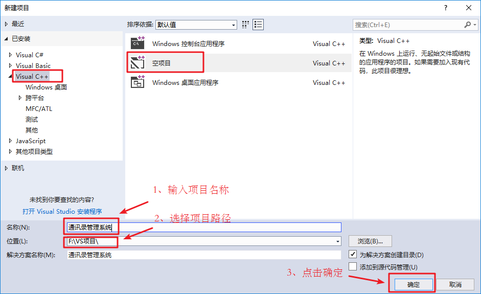
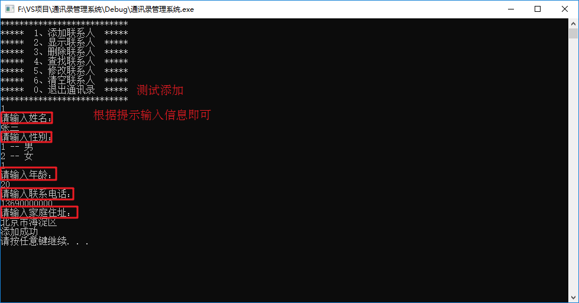
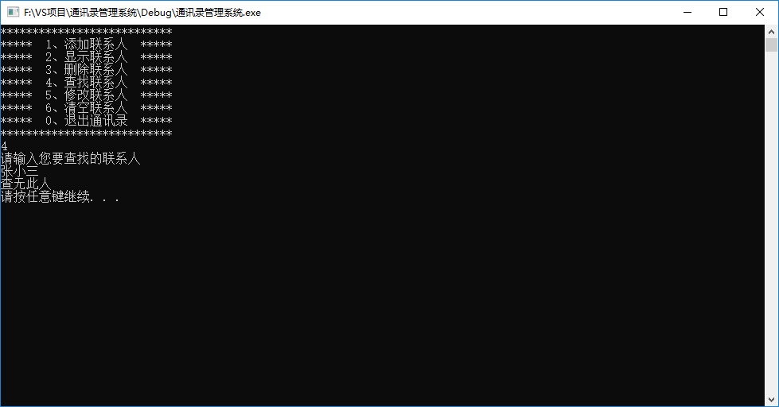
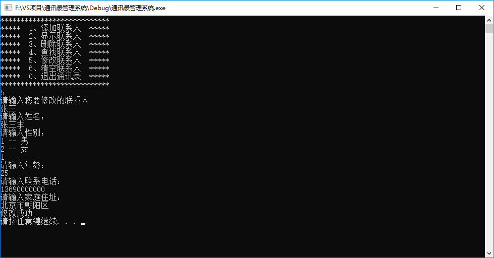
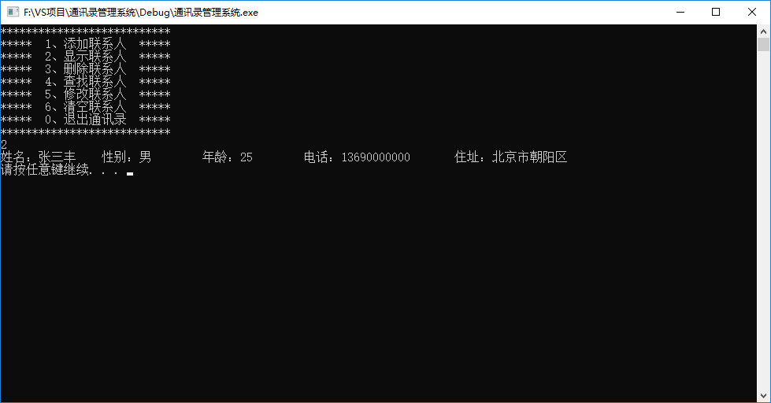
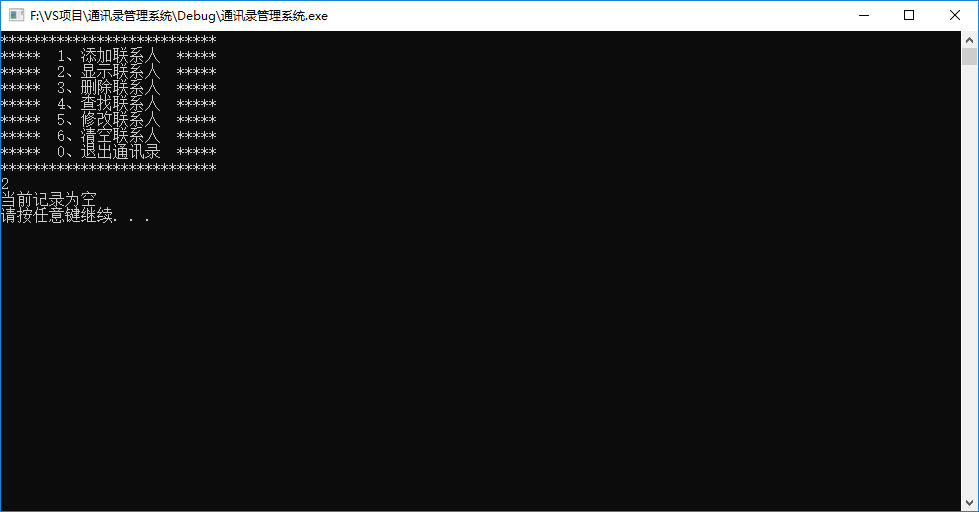

# 通讯录管理系统


## 1、系统需求

通讯录是一个可以记录亲人、好友信息的工具。

本教程主要利用C++来实现一个通讯录管理系统

系统中需要实现的功能如下：

* 添加联系人：向通讯录中添加新人，信息包括（姓名、性别、年龄、联系电话、家庭住址）最多记录1000人
* 显示联系人：显示通讯录中所有联系人信息
* 删除联系人：按照姓名进行删除指定联系人
* 查找联系人：按照姓名查看指定联系人信息
* 修改联系人：按照姓名重新修改指定联系人
* 清空联系人：清空通讯录中所有信息
* 退出通讯录：退出当前使用的通讯录


## 2、创建项目

创建项目步骤如下：

* 创建新项目
* 添加文件

### 2.1 创建项目

打开vs2017后，点击创建新项目，创建新的C++项目


填写项目名称，选择项目路径



### 2.2添加文件


添加成功后，效果如图：


至此，项目已创建完毕


## 3、菜单功能

**功能描述：** 用户选择功能的界面

菜单界面效果如下图：


**步骤：**

* 封装函数显示该界面  如 `void showMenu()`
* 在main函数中调用封装好的函数


**代码：**

```C++
#include<iostream>
using namespace std;

//build Menu
void showMenu()
{
	cout << "***************************" << endl;
	cout << "*****  1 add contacts  *****" << endl;
	cout << "*****  2 show contacts  *****" << endl;
	cout << "*****  3 delete contacts  *****" << endl;
	cout << "*****  4 find contacts  *****" << endl;
	cout << "*****  5 modify contacts  *****" << endl;
	cout << "*****  6 clean all contacts  *****" << endl;
	cout << "*****  0 shut down machine  *****" << endl;
	cout << "***************************" << endl;
}

int main() {

	showMenu();

	system("pause");

	return 0;
}
```


## 4、退出功能

功能描述：退出通讯录系统


思路：根据用户不同的选择，进入不同的功能，可以选择switch分支结构，将整个架构进行搭建


当用户选择0时候，执行退出，选择其他先不做操作，也不会退出程序


**代码：**

```C++
int main() {

	int select = 0;

	while (true)
	{
		showMenu();

		cin >> select;
		
		switch (select)
		{
		case 1:  //add contacts
            addPerson(&abs); //Using address passing, you can modify actual parameters.
			break;
		case 2:  //show contacts
            showContacts(&abs);
			break;
		case 3:  //delete contacts 
            deleteContact(&abs);
			break;
		case 4:  //find contacts
            findContact(&abs);
			break;
		case 5:  //modify contacts
            modifyContact(&abs);
			break;
		case 6:  //empty contacts
            cleanPerson(&abs);
			break;
		case 0:  //shut down machine
			cout << "I am happy to serve you" << endl;
			return 0;
			break;
		default:
			break;
		}
	}

	return 0;
}
```


效果图：


## 5、添加联系人

功能描述：

实现添加联系人功能，联系人上限为1000人，联系人信息包括（姓名、性别、年龄、联系电话、家庭住址）


添加联系人实现步骤：

* 设计联系人结构体
* 设计通讯录结构体
* main函数中创建通讯录
* 封装添加联系人函数
* 测试添加联系人功能


### 5.1 设计联系人结构体

联系人信息包括：姓名、性别、年龄、联系电话、家庭住址

设计如下：

```C++
#include <string>  //string头文件
//bulid Person structure
struct Person
{
	string m_Name; //name
	int m_Sex; //sex
	int m_Age; //age
	string m_Phone; //phone
	string m_Addr; //address
};
```


### 5.2 设计通讯录结构体

设计时候可以在通讯录结构体中，维护一个容量为1000的存放联系人的数组，并记录当前通讯录中联系人数量

设计如下

```C++
//build Addressbooks structure
#define MAX 1000 //Max number of people
struct Addressbooks
{
    struct Person personArray[MAX]; //The maximum number of contacts that your address book can accommodate
    int m_Size; //the current number of contacts in your address book
};
```


### 5.3 main函数中创建通讯录


添加联系人函数封装好后，在main函数中创建一个通讯录变量，这个就是我们需要一直维护的通讯录


```c++
mian函数起始位置添加：

int main() {

    //build Addressbooks
    struct Addressbooks abs;
    abs.m_Size = 0;

```


### 5.4 封装添加联系人函数


思路：添加联系人前先判断通讯录是否已满，如果满了就不再添加，未满情况将新联系人信息逐个加入到通讯录


添加联系人代码：


```C++
//1. add contacts
void addPerson(struct Addressbooks * abs)
{
    //Check if address book is full, no more adding. 
    if(abs->m_Size > MAX)
    {
        cout << "Sorry, cannot add. Address book already full." << endl;
		return;
    }
    else
    {
        //name
        string name;
        cout<<"please enter your name"<<endl;
        cin >> name;
        abs->personArray[abs->m_Size].m_Name = name;

        //sex
        cout<<"please enter your sex"<<endl;
        cout<<"1 -- male"<<endl;
        cout<<"0 -- female"<<endl;
        int sex = 0;
        while(1)
        {
            cin>>sex;
            if (sex == 1 || sex == 0)
            {
                abs->personArray[abs->m_Size].m_Sex = sex;
                break;
            }
            else
            {
                cout<<"Input error, please enter your sex"<<endl;
                cout<<"1 -- male"<<endl;
                cout<<"2 -- female"<<endl;
            }
        }
        
        //age
        cout<<"please enter your age"<<endl;
        int Age;
        cin>>Age;
        abs->personArray[abs->m_Size].m_Age = Age;

        //Phone
        cout<<"please enter your phone"<<endl;
        string Phone;
        cin>>Phone;
        abs->personArray[abs->m_Size].m_Phone = Phone;

        //Address
        cout<<"please enter your address"<<endl;
        string Address;
        cin>>Address;
        abs->personArray[abs->m_Size].m_Addr = Address;

        //update m_Size
        abs->m_Size++;

        cout<<"Great news! You have successfully added a new contact."<<endl;
        system("pause"); //pause terminal
        system("cls"); //clear terminal
    }   
}
```


### 5.5 测试添加联系人功能

选择界面中，如果玩家选择了1，代表添加联系人，我们可以测试下该功能


在switch case 语句中，case1里添加：

```C++
case 1:  //add contacts
	addContacts(&abs); //Using address passing, you can modify actual parameters.
	break;
```


测试效果如图：




## 6、显示联系人

功能描述：显示通讯录中已有的联系人信息


显示联系人实现步骤：

* 封装显示联系人函数
* 测试显示联系人功能

### 6.1 封装显示联系人函数


思路：判断如果当前通讯录中没有人员，就提示记录为空，人数大于0，显示通讯录中信息


显示联系人代码：

```C++
//2. show contacts
void showContacts(struct Addressbooks * abs)
{
    if (abs->m_Size == 0)
    {
        cout<<"Your address boos is empty"<<endl;
    }
    else
    {
        for (int i = 0 ; i < abs->m_Size ; i++)
        {
			cout << "Name:" << abs->personArray[i].m_Name << "\t";
			cout << "Sex:" << (abs->personArray[i].m_Sex == 1 ? "male" : "female") << "\t";
			cout << "Age:" << abs->personArray[i].m_Age << "\t";
			cout << "Phone" << abs->personArray[i].m_Phone << "\t";
			cout << "Address:" << abs->personArray[i].m_Addr << endl;
        }
    }
    system("pause"); //pause terminal
    system("cls"); //clear terminal
}
```


### 6.2 测试显示联系人功能


在switch case语句中，case 2 里添加

```C++
case 2:  //show contacts
	showContacts(&abs);
	break;
```


测试效果如图：


## 7、删除联系人

功能描述：按照姓名进行删除指定联系人


删除联系人实现步骤：

* 封装检测联系人是否存在
* 封装删除联系人函数
* 测试删除联系人功能


### 7.1  封装检测联系人是否存在

设计思路：


删除联系人前，我们需要先判断用户输入的联系人是否存在，如果存在删除，不存在提示用户没有要删除的联系人

因此我们可以把检测联系人是否存在封装成一个函数中，如果存在，返回联系人在通讯录中的位置，不存在返回-1


检测联系人是否存在代码：

```C++
//Checking if contact exists. Return position if exists, else return -1.
int isExist(struct Addressbooks * abs, string name)
{
    for (int i = 0 ; i < abs->m_Size ; i++)
    {
        if (abs->personArray[i].m_Name == name)
        {
            return i;  //found contact, return his index
        }
    }
    return -1;  //if not found iterating, return `-1`
}

```


### 7.2 封装删除联系人函数


根据用户输入的联系人判断该通讯录中是否有此人

查找到进行删除，并提示删除成功

查不到提示查无此人。


```C++
//3. delete contact
void deleteContact(struct Addressbooks * abs)
{
    string name;
    cout<<"enter a name contact you want to delete"<<endl;
    cin>>name;
    int number = isExist(abs, name);
    if (number == -1)
    {
        cout<<"Can't delete, contact not in address book."<<endl;
    }
    else
    {
        //Contact found, delete contact
        for (int i = number ; i < abs->m_Size ; i++)
        {
            //moving data forward
            abs->personArray[i] = abs->personArray[i+1];
        }
        abs->m_Size--;  //update personnel count in address book
    }
    system("pause"); //pause terminal
    system("cls"); //clear terminal
}
```


### 7.3 测试删除联系人功能

在switch case 语句中，case3里添加：

```C++
case 3:  //delete contacts 
	deleteContact(&abs);
	break;
```

测试效果如图：

存在情况：


不存在情况：


## 8、查找联系人

功能描述：按照姓名查看指定联系人信息

查找联系人实现步骤

* 封装查找联系人函数
* 测试查找指定联系人

### 8.1 封装查找联系人函数

实现思路：判断用户指定的联系人是否存在，如果存在显示信息，不存在则提示查无此人。

查找联系人代码：

```C++
//4. find contact
void findContact(struct Addressbooks * abs)
{
    cout<<"enter a contact you want to check"<<endl;
    string name;
    cin >> name;

    //Checking if the specified contact is in the address book.
    int index = isExist(abs,name);
    if (index == -1)
    {
        cout<<"can not find the specified contact"<<endl;
    }
    else
    {
        showContactDetail(abs,index);
    }
    system("pause"); //pause terminal
    system("cls"); //clear terminal
}
```


### 8.2 测试查找指定联系人

在switch case 语句中，case4里添加：

```C++
case 4:  //find contacts
	findContact(&abs);
	break;
```


测试效果如图

存在情况：


不存在情况：


## 9、修改联系人

功能描述：按照姓名重新修改指定联系人

修改联系人实现步骤

* 封装修改联系人函数
* 测试修改联系人功能


### 9.1 封装修改联系人函数

实现思路：查找用户输入的联系人，如果查找成功进行修改操作，查找失败提示查无此人


修改联系人代码：

```C++
//5. modify contact
void modifyContact(struct Addressbooks * abs)
{
    cout<<"enter a contact you want to modify"<<endl;
    string name;
    cin >> name;

    //Checking if the specified contact is in the address book.
    int index = isExist(abs,name);
    if (index == -1)
    {
        cout<<"can not find the specified contact"<<endl;
    }
    else
    {
        //modify name
        cout<<"modify the name"<<endl;
        string name;
        cin>>name;
        abs->personArray[index].m_Name = name;

        //modify sex
        cout<<"modify the sex"<<endl;
        cout<<"1 -- male"<<endl;
        cout<<"0 -- female"<<endl;
        int sex;
        cin>>sex;
        while(true)
        {
            if (sex == 0 || sex == 1)
            {
                //valid input, exit the loop
                abs->personArray[index].m_Sex = sex;
                break;
            }
            else
            {
                //invalid input
                cout<<"Invalid input"<<endl;
                break;
            }
        }

        //modify age
        cout<<"modify the age"<<endl;
        int age;
        cin>>age;
        abs->personArray[index].m_Age = age;

        //modify phone
        cout<<"modify the phone"<<endl;
        int phone;
        cin>>phone;
        abs->personArray[index].m_Phone = phone;

        //modify address
        cout<<"modify the address"<<endl;
        string address;
        cin>>address;
        abs->personArray[index].m_Addr = address;
    }
    system("pause"); //pause terminal
    system("cls"); //clear terminal
}
```


### 9.2 测试修改联系人功能

在switch case 语句中，case 5里添加：

```C++
case 5:  //modify Contact
	modifyContact(&abs);
	break;
```


测试效果如图：

查不到指定联系人情况：



查找到联系人，并修改成功：



再次查看通讯录，确认修改完毕




## 10、清空联系人

功能描述：清空通讯录中所有信息

清空联系人实现步骤

* 封装清空联系人函数
* 测试清空联系人

### 10.1 封装清空联系人函数

实现思路： 将通讯录所有联系人信息清除掉，只要将通讯录记录的联系人数量置为0，做逻辑清空即可。

清空联系人代码：

```C++
//6. clean all contacts
void cleanAllcontacts(struct Addressbooks * abs)
{
    abs->m_Size = 0;    //Set the number of current recorded contacts to 0 to logically clear them.
    cout<<"The address book has been cleared"<<endl;
    system("pause"); //pause terminal
    system("cls"); //clear terminal
}
```


### 10.2  测试清空联系人

在switch case 语句中，case 6 里添加：

```C++
case 6:  //empty contacts
	cleanAllcontacts(&abs);
	break;
```


测试效果如图：

清空通讯录


再次查看信息，显示记录为空




**至此，通讯录管理系统完成！**

**我們來查看最後的程式碼**
```c++
#include<iostream>
using namespace std;

//build Menu
void showMenu()
{
	cout << "***************************" << endl;
	cout << "*****  1 add contacts  *****" << endl;
	cout << "*****  2 show contacts  *****" << endl;
	cout << "*****  3 delete contacts  *****" << endl;
	cout << "*****  4 find contacts  *****" << endl;
	cout << "*****  5 modify contacts  *****" << endl;
	cout << "*****  6 clean all contacts  *****" << endl;
	cout << "*****  0 shut down machine  *****" << endl;
	cout << "***************************" << endl;
}

//bulid Person structure
struct Person
{
	string m_Name; //name
	int m_Sex; //sex
	int m_Age; //age
	string m_Phone; //phone
	string m_Addr; //address
};

//build Addressbooks structure
#define MAX 1000 //Max number of people
struct Addressbooks
{
    struct Person personArray[MAX]; //The maximum number of contacts that your address book can accommodate
    int m_Size; //the current number of contacts in your address book
};

//1. add contacts
void addContacts(struct Addressbooks * abs)
{
    //Check if address book is full, no more adding. 
    if(abs->m_Size > MAX)
    {
        cout << "Sorry, cannot add. Address book already full." << endl;
		return;
    }
    else
    {
        //name
        string name;
        cout<<"please enter your name"<<endl;
        cin >> name;
        abs->personArray[abs->m_Size].m_Name = name;

        //sex
        cout<<"please enter your sex"<<endl;
        cout<<"1 -- male"<<endl;
        cout<<"0 -- female"<<endl;
        int sex = 0;
        while(1)
        {
            cin>>sex;
            if (sex == 1 || sex == 0)
            {
                abs->personArray[abs->m_Size].m_Sex = sex;
                break;
            }
            else
            {
                cout<<"Input error, please enter your sex"<<endl;
                cout<<"1 -- male"<<endl;
                cout<<"2 -- female"<<endl;
            }
        }
        
        //age
        cout<<"please enter your age"<<endl;
        int Age;
        cin>>Age;
        abs->personArray[abs->m_Size].m_Age = Age;

        //Phone
        cout<<"please enter your phone"<<endl;
        string Phone;
        cin>>Phone;
        abs->personArray[abs->m_Size].m_Phone = Phone;

        //Address
        cout<<"please enter your address"<<endl;
        string Address;
        cin>>Address;
        abs->personArray[abs->m_Size].m_Addr = Address;

        //update m_Size
        abs->m_Size++;

        cout<<"Great news! You have successfully added a new contact."<<endl;
        system("pause"); //pause terminal
        system("cls"); //clear terminal
    }   
}

//2. show contacts
void showContacts(struct Addressbooks * abs)
{
    if (abs->m_Size == 0)
    {
        cout<<"Your address boos is empty"<<endl;
    }
    else
    {
        for (int i = 0 ; i < abs->m_Size ; i++)
        {
			cout << "Name:" << abs->personArray[i].m_Name << "\t";
			cout << "Sex:" << (abs->personArray[i].m_Sex == 1 ? "male" : "female") << "\t";
			cout << "Age:" << abs->personArray[i].m_Age << "\t";
			cout << "Phone" << abs->personArray[i].m_Phone << "\t";
			cout << "Address:" << abs->personArray[i].m_Addr << endl;
        }
    }
    system("pause"); //pause terminal
    system("cls"); //clear terminal
}

//Checking if contact exists. Return position if exists, else return -1.
int isExist(struct Addressbooks * abs, string name)
{
    for (int i = 0 ; i < abs->m_Size ; i++)
    {
        if (abs->personArray[i].m_Name == name)
        {
            return i;  //found contact, return his index
        }
    }
    return -1;  //if not found iterating, return `-1`
}

//3. delete contact
void deleteContact(struct Addressbooks * abs)
{
    string name;
    cout<<"enter a name contact you want to delete"<<endl;
    cin>>name;
    int number = isExist(abs, name);
    if (number == -1)
    {
        cout<<"Can't delete, contact not in address book."<<endl;
    }
    else
    {
        //Contact found, delete contact
        for (int i = number ; i < abs->m_Size ; i++)
        {
            //moving data forward
            abs->personArray[i] = abs->personArray[i+1];
        }
        abs->m_Size--;  //update personnel count in address book
    }
    system("pause"); //pause terminal
    system("cls"); //clear terminal
}

void showContactDetail(struct Addressbooks * abs, int index)
{
    cout << "Name:" << abs->personArray[index].m_Name << "\t";
    cout << "Sex:" << (abs->personArray[index].m_Sex == 1 ? "male" : "female") << "\t";
    cout << "Age:" << abs->personArray[index].m_Age << "\t";
    cout << "Phone" << abs->personArray[index].m_Phone << "\t";
    cout << "Address:" << abs->personArray[index].m_Addr << endl;
}

//4. find contact
void findContact(struct Addressbooks * abs)
{
    cout<<"enter a contact you want to check"<<endl;
    string name;
    cin >> name;

    //Checking if the specified contact is in the address book.
    int index = isExist(abs,name);
    if (index == -1)
    {
        cout<<"can not find the specified contact"<<endl;
    }
    else
    {
        showContactDetail(abs,index);
    }
    system("pause"); //pause terminal
    system("cls"); //clear terminal
}

//5. modify contact
void modifyContact(struct Addressbooks * abs)
{
    cout<<"enter a contact you want to modify"<<endl;
    string name;
    cin >> name;

    //Checking if the specified contact is in the address book.
    int index = isExist(abs,name);
    if (index == -1)
    {
        cout<<"can not find the specified contact"<<endl;
    }
    else
    {
        //modify name
        cout<<"modify the name"<<endl;
        string name;
        cin>>name;
        abs->personArray[index].m_Name = name;

        //modify sex
        cout<<"modify the sex"<<endl;
        cout<<"1 -- male"<<endl;
        cout<<"0 -- female"<<endl;
        int sex;
        cin>>sex;
        while(true)
        {
            if (sex == 0 || sex == 1)
            {
                //valid input, exit the loop
                abs->personArray[index].m_Sex = sex;
                break;
            }
            else
            {
                //invalid input
                cout<<"Invalid input"<<endl;
                break;
            }
        }

        //modify age
        cout<<"modify the age"<<endl;
        int age;
        cin>>age;
        abs->personArray[index].m_Age = age;

        //modify phone
        cout<<"modify the phone"<<endl;
        int phone;
        cin>>phone;
        abs->personArray[index].m_Phone = phone;

        //modify address
        cout<<"modify the address"<<endl;
        string address;
        cin>>address;
        abs->personArray[index].m_Addr = address;
    }
    system("pause"); //pause terminal
    system("cls"); //clear terminal
}

//6. clean all contacts
void cleanAllcontacts(struct Addressbooks * abs)
{
    abs->m_Size = 0;    //Set the number of current recorded contacts to 0 to logically clear them.
    cout<<"The address book has been cleared"<<endl;
    system("pause"); //pause terminal
    system("cls"); //clear terminal
}


int main() {

    //build Addressbooks
    struct Addressbooks abs;
    abs.m_Size = 0;


	int select = 0;

	while (true)
	{
		showMenu();

		cin >> select;
		
		switch (select)
		{
		case 1:  //add contacts
            addContacts(&abs); //Using address passing, you can modify actual parameters.
			break;
		case 2:  //show contacts
            showContacts(&abs);
			break;
		case 3:  //delete contacts 
            deleteContact(&abs);
			break;
		case 4:  //find contacts
            findContact(&abs);
			break;
		case 5:  //modify contacts
            modifyContact(&abs);
			break;
		case 6:  //empty contacts
            cleanAllcontacts(&abs);
			break;
		case 0:  //shut down machine
			cout << "I am happy to serve you" << endl;
			return 0;
			break;
		default:
			break;
		}
	}

	return 0;
}

```