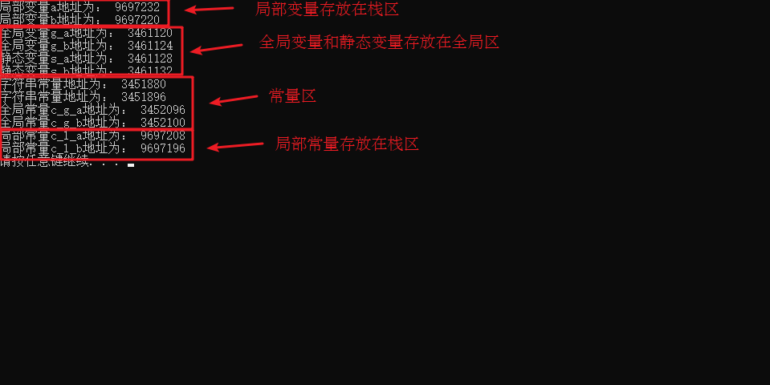

# C++核心編程

本階段主要針對C++==面向對象==編程技術做詳細講解，探討C++中的核心和精髓。


## 1 內存分區模型

C++程序在執行時，將內存大方向劃分為**4個區域**

- **代碼區**：存放函數體的二進制代碼，由操作系統進行管理的
- **全局區**：存放全局變量和靜態變量以及常量
- **棧區**：由編譯器自動分配釋放, 存放函數的參數值,局部變量等
- **堆區**：由程序員分配和釋放,若程序員不釋放,程序結束時由操作系統回收


**內存四區意義：**

不同區域存放的數據，賦予不同的生命週期, 給我們更大的靈活編程


### 1.1 程序運行前

​	在程序編譯後，生成了exe可執行程序，**未執行該程序前**分為兩個區域

​	**代碼區：**

​		存放 CPU 執行的機器指令

​		代碼區是**共享**的，共享的目的是對於頻繁被執行的程序，只需要在內存中有一份代碼即可

​		代碼區是**只讀**的，使其只讀的原因是防止程序意外地修改了它的指令

​	**全局區：**

​		全局變量和靜態變量存放在此.

​		全局區還包含了常量區, 字符串常量和其他常量也存放在此.

​		==該區域的數據在程序結束後由操作系統釋放==.


**示例：**

```c++
#include<iostream>
using namespace std;

//全局變數
int g_a = 10;
int g_b = 10;

//const修飾的全局變數 = 全局常數
const int c_g_a = 10;
const int c_g_b = 10;


int main(){

	//創建普通局部變數
	int a = 10;
	int b = 10;

	//打印地址
	cout << "局部變數a地址為： " << (int)&a << endl;
	cout << "局部變數b地址為： " << (int)&b << endl;

	cout << "全局變數g_a地址為： " <<  (int)&g_a << endl;
	cout << "全局變數g_b地址為： " <<  (int)&g_b << endl;

	//靜態變量，在普通便量前面加static，就屬於靜態變量
	static int s_a = 10;
	static int s_b = 10;
	cout << "靜態變數s_a地址為： " << (int)&s_a << endl;
	cout << "靜態變數s_b地址為： " << (int)&s_b << endl;

	//常數
	//字符串常數
	cout << "字符串常數地址為： " << (int)&"hello world" << endl;
	cout << "字符串常數地址為： " << (int)&"hello world1" << endl;

	//const修飾的變數、
	//const修飾的全局變數
	cout << "全局常數c_g_a地址為： " << (int)&c_g_a << endl;
	cout << "全局常數c_g_b地址為： " << (int)&c_g_b << endl;

	//const修飾的局部變數
	//c-const   g-global    l-local
	const int c_l_a = 10;
	const int c_l_b = 10;
	cout << "局部常數c_l_a地址為： " << (int)&c_l_a << endl;
	cout << "局部常數c_l_b地址為： " << (int)&c_l_b << endl;

	system("pause");

	return 0;
}
```

打印結果：




總結：

* C++中在程序運行前分為全局區和代碼區
* 代碼區特點是共享和只讀
* 全局區中存放全局變量、靜態變量、常量
* 常量區中存放 const修飾的全局常量  和 字符串常量


### 1.2 程序運行後


​	**棧區：**

​		由編譯器自動分配釋放, 存放函數的參數值,局部變量等

​		**注意事項**：不要返回局部變量的地址，棧區開闢的數據由編譯器自動釋放


**示例：**

```c++
#include<iostream>
using namespace std;

//棧區數據的注意事項 -- 不要返回局部變量的地址
//棧區的數據由編譯器管理開闢與釋放

int * func(int b) //型參數據也會放在棧區
{
	b = 100;
	int a = 10;	//局部變量，存放在棧區，棧區的數據在函數執行完後自動釋放
	return &a;	//返回局部變量的地址
}

int main(){

	int * p = func(1);	//第一次可以打印正確的數字，是因為編譯器做了保留
	cout<<*p<<endl;		//第二次這個數據就不再保留了
	return 0;
}
```


​	**堆區：**

​		由程序員分配釋放,若程序員不釋放,程序結束時由操作系統回收

​		在C++中主要利用`new`在堆區開闢內存

**示例：**

```c++
#include<iostream>
using namespace std;

int * func() //型參數據也會放在棧區
{
	//利用new關鍵字，可以將數據開闢到堆區
	//指針本質也是局部變量，放在棧上，則指針保存的數據是放在堆區
	int * p = new int(10);
	return p;
}

int main(){

	//開闢數據內存
	int * p = func();
	cout<<*p<<endl;		
	
	system("pause");
	return 0;
}
```


**總結：**

堆區數據由程序員管理開闢和釋放

堆區數據利用new關鍵字進行開闢內存


### 1.3 new操作符


​	C++中利用==new==操作符在堆區開闢數據

​	堆區開闢的數據，由程序員手動開闢，手動釋放，釋放利用操作符 ==delete==

​	語法：` new 數據類型`

​	利用new創建的數據，會返回該數據對應的類型的指針


**示例1： 基本語法**

```c++
#include<iostream>
using namespace std;


//1. new的基本語法
int * func()
{
	//在堆區創建整形數據
	//new返回是 該數據類型的指針
	int * p = new int(10);
	return p;
}

int test01() 
{
	int * p = func();
	cout<<*p<<endl;

	//堆區的數據由程序員管理開闢，程序員管理釋放
	//如果想釋放堆區的數據，利用關鍵字delete
	delete p;

	cout<<*p<<endl;	//內存已經被釋放，再訪問一次就會報錯
}

int main(){
	test01();
}
```


**示例2：開闢數組**

```c++
#include<iostream>
using namespace std;


//1. new的基本語法
int * func()
{
	//在堆區創建整形數據
	//new返回是 該數據類型的指針
	int * p = new int(10);
	return p;
}

int test01() 
{
	int * p = func();
	cout<<*p<<endl;

	//堆區的數據由程序員管理開闢，程序員管理釋放
	//如果想釋放堆區的數據，利用關鍵字delete
	delete p;

	cout<<*p<<endl;	//內存已經被釋放，再訪問一次就會報錯或是亂碼
}

//2. 在堆區利用new開闢數組
void test02()
{
	//創建10個整型數據的數組，在堆區
	int * arr = new int[10];	//10代表數組有10個元素

	for (int i = 0 ; i < 10 ; i++)
	{
		arr[i] = i + 100;	//給10個元素賦予數值  100~109
	}

	//打印數組
	for (int i = 0 ; i < 10 ; i++)
	{
		cout<<arr[i]<<endl;
	}

	//釋放堆區數組
	//釋放數組的時候要加上[]才可以
	delete[] arr;

}

int main(){
	test01();
	test02();
}

```